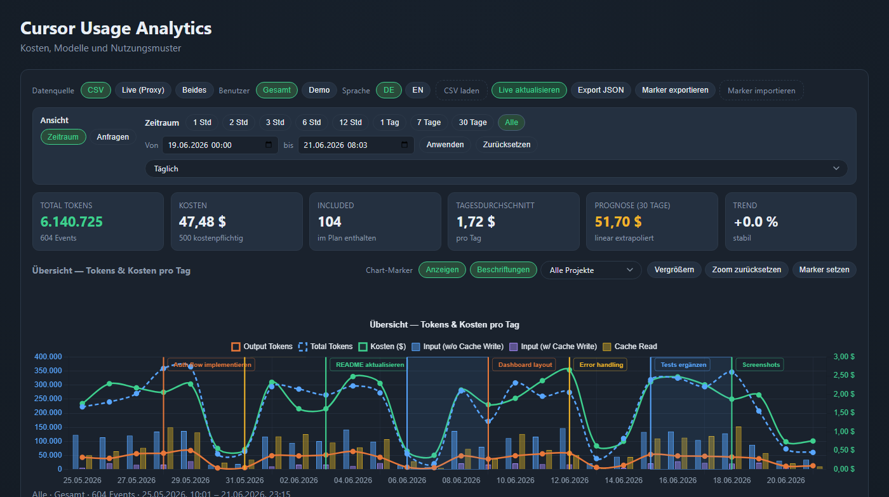
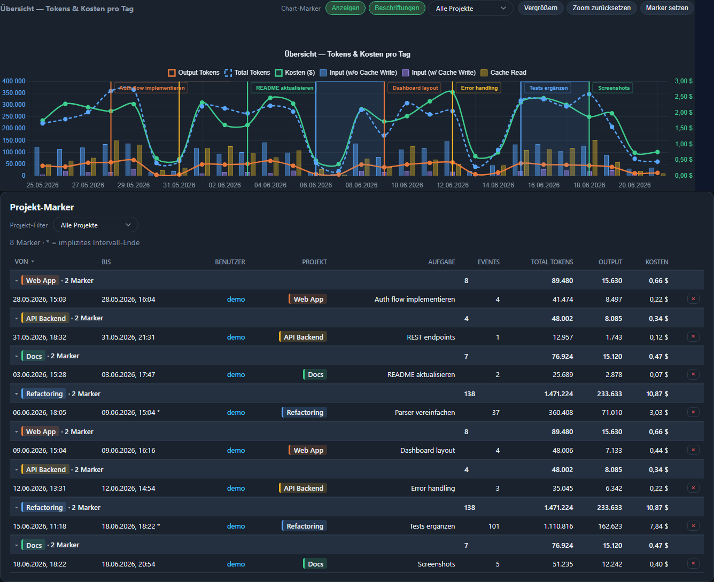
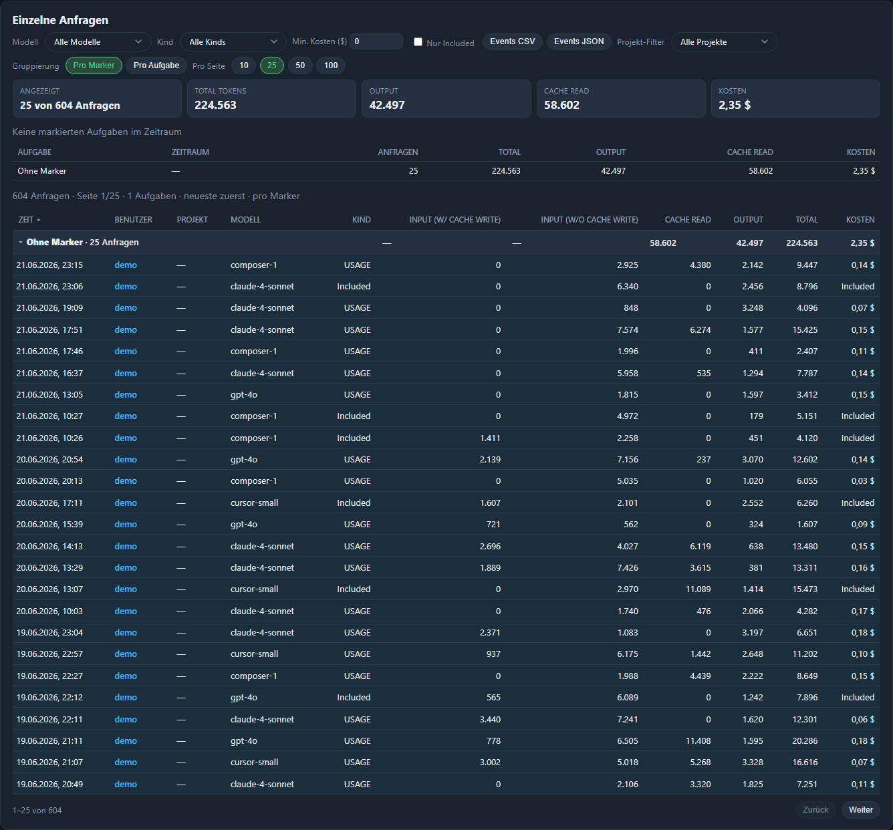

# Cursor Usage Dashboard

Local dashboard for **Cursor IDE usage** — token timeline, costs, models, budget, and project markers (including hover info in charts and tables, optionally disableable). Built for personal multi-account setups (CSV + optional unofficial live API).

**Deutsch:** [README.md](README.md)

## Pages

| Page | Focus |
| ---- | ----- |
| [cursor-usage-analytics.html](cursor-usage-analytics.html) | **Costs & patterns**, live data, budget, zoom |
| [index.html](index.html) | Hub / navigation |

## Quick start

```powershell
git clone https://github.com/70hundert/cursor-usage-analytics.git
cd cursor-usage-analytics
python -m venv venv
.\venv\Scripts\Activate.ps1
pip install -r requirements.txt
python serve.py
```

Or: `.\start.ps1`

Open **http://127.0.0.1:8060/**

> **Note:** Opening via `file://` does not work. Keep the server bound to `127.0.0.1` only.

## Demo without a live token

Try the dashboard with synthetic data in [`samples/`](samples/):

```powershell
Copy-Item config\users.example.json config\users.json
python serve.py
```

Select user **Demo** in analytics — four weeks of usage events plus sample project markers (markers are seeded into `data/project-markers.json` on first start if that file does not exist yet). Regenerate: `python scripts/generate_demo_data.py`

## Configure users

Edit [`config/users.json`](config/users.json) (template: [`config/users.example.json`](config/users.example.json)):

```json
{
  "users": [
    {
      "id": "primary",
      "label": "Primary",
      "defaultCsvPaths": ["./data/usage-events-primary.csv"]
    }
  ]
}
```

Live tokens in `.env` (from `.env.example`):

```
CURSOR_SESSION_TOKEN_PRIMARY=...
```

Env var pattern: `CURSOR_SESSION_TOKEN_<ID>` (ID from `users.json`, uppercase).

Get token: DevTools → Application → Cookies → `https://cursor.com` → `WorkosCursorSessionToken`

## Data sources

### CSV export

Cursor Dashboard → Usage → export to `data/` — paths in `config/users.json`.

Expected columns include: `Date`, `Model`, `Kind`, `Cost`, token columns.

### Live API (unofficial)

Reverse-engineered endpoints (credit: [dmwyatt/cursor-usage](https://github.com/dmwyatt/cursor-usage)):

- `GET /api/usage-summary`
- `POST /api/dashboard/get-filtered-usage-events`

In analytics: **Live (proxy)** or **Both**. Health: http://127.0.0.1:8060/health

## Optional: Auto-markers (Cursor Hooks)

Project markers can be created automatically from Composer chats — **no third-party extension**, only native [Cursor Hooks](https://cursor.com/docs/hooks.md).

**Requirements:** `python serve.py` running; user id from `config/users.json`.

```powershell
.\scripts\setup-marker-hooks.ps1
```

Then edit `%USERPROFILE%\.cursor\marker-hook.json` (`defaultUser`, optional `dashboardRoot` for offline fallback). Reload Cursor; check **Settings → Hooks**.

| Composer mode | Auto-marker |
| ------------- | ----------- |
| Agent | Yes |
| Edit | Yes |
| Ask | No (default) |
| Tab (inline) | No |

Works the same in the **Agents window** and the **editor** (same Composer pipeline). Details: [docs/REFERENCE.md — Auto-Marker](docs/REFERENCE.md#auto-marker-cursor-hooks-optional).

**Disclaimer:** Not an official Cursor API. Endpoints may change; session tokens expire. Use at your own risk; respect Cursor’s terms of service.

## Configuration

| Variable | Default | Description |
| -------- | ------- | ----------- |
| `CURSOR_WEB_HOST` | `127.0.0.1` | Bind address |
| `CURSOR_WEB_PORT` | `8060` | HTTP port |
| `CURSOR_SESSION_TOKEN_<USER>` | — | Session token per user id in `config/users.json` |
| `CURSOR_MARKER_DEFAULT_USER` | — | Optional: dashboard user for auto-marker hooks |
| `CURSOR_MARKER_API_BASE` | `http://127.0.0.1:8060` | Optional: API base URL for hook script |

## Project structure

```
serve.py
config/users.example.json
samples/              # demo CSV + markers (committed)
scripts/generate_demo_data.py
scripts/cursor-marker-hook.py
scripts/setup-marker-hooks.ps1
config/marker-hook.example.json
cursor-usage-analytics.html
static/cursor-analytics/
data/                 # gitignored CSV exports
docs/REFERENCE.md
```

## Related projects

| Project | Focus |
| ------- | ----- |
| [dmwyatt/cursor-usage](https://github.com/dmwyatt/cursor-usage) | CLI for unofficial API |
| [ofershap/cursor-usage-tracker](https://github.com/ofershap/cursor-usage-tracker) | Enterprise teams, alerts, admin API |
| [apptension/curstat](https://github.com/apptension/curstat) | Personal CSV-only visualizer |

## Screenshots

Demo data (user **Demo**), time range **All**:

| Overview & KPIs | Project markers | Individual requests |
| --------------- | --------------- | ------------------- |
|  |  |  |

Regenerate (README/demo): `python scripts/capture-screenshots.py --demo-markers` — temporarily swaps demo markers and restores your `data/project-markers.json` afterward. Without the flag, existing markers are left unchanged.

## Known limitations

- Python server required
- Chart.js from jsDelivr CDN
- No Enterprise Admin API
- Large event sets may slow the browser

## Feedback

Early-stage side project (v0.1). Issues, bug reports, and ideas are welcome. For larger changes, please open an issue first. See [SECURITY.md](SECURITY.md) for sensitive reports.

## License

[MIT](LICENSE)
