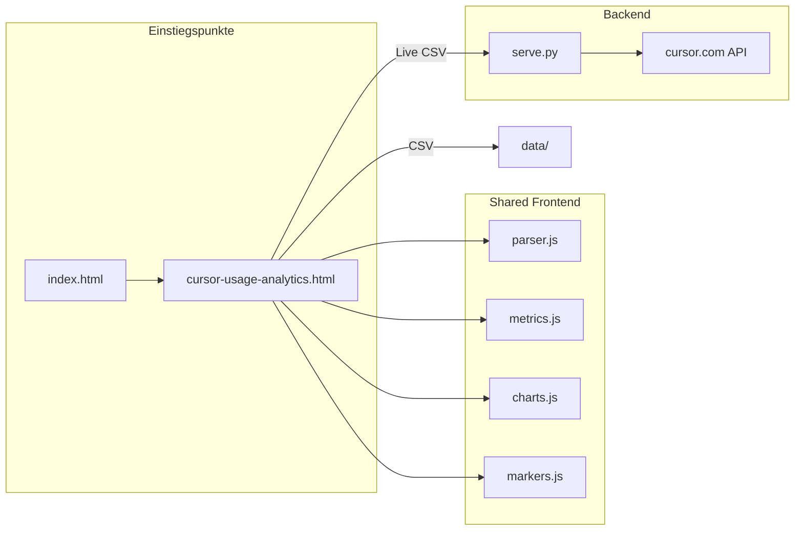

> Letzte Verifikation: 2026-06-22
> Geprüfte Dateien: 18
> Projektstand: v0.1.0 (committed)
> Cursor Rule: `.cursor/rules/cursor-usage-dashboard.mdc`

# Cursor Usage Dashboard — Feature-Referenz

Master-Referenz für AI-Chats. Abdeckung: Hub, Analytics (Thin-Shell), Shared-Module, Backend.

---

## 1. Quick-Lookup


| Aufgabe                                                       | Primäre Datei(en)                                                                              |
| ------------------------------------------------------------- | ---------------------------------------------------------------------------------------------- |
| CSV/API-Parsing, Event-Modell, Dedupe                         | `static/cursor-analytics/parser.js`                                                            |
| KPIs, Filter, Aggregationen, Granularität                     | `static/cursor-analytics/metrics.js`                                                           |
| Chart-Rendering, Legend-Persistenz, Zoom, Marker-Annotationen | `static/cursor-analytics/charts.js`                                                            |
| Projekt-Marker (CRUD, Statistik, Sync, Popover, Fokus)        | `static/cursor-analytics/markers.js`                                                           |
| Analytics-UI, Live-Fetch, Toolbar, Budget                     | `cursor-usage-analytics.html` (inline `<script>`)                                              |
| Live-API, Static-Serving, Event-Cache                         | `serve.py`                                                                                     |
| Multi-User-Konfiguration                                      | `users-config.js`, `serve.py` (`USER_TOKENS`), `.env`                                          |
| Navigation Hub                                                | `index.html`                                                                                   |
| Server-Start / Live-Setup                                     | `start.ps1`, `setup-live.ps1`                                                                  |


---

## 2. Architektur-Überblick

**Muster:** Analytics Thin-Shell + optionaler Hub — ein Parser in `parser.js`, kein Fork.




| Einstiegspunkt  | Muster               | Datenquellen                      | Shared-Module                  |
| --------------- | -------------------- | --------------------------------- | ------------------------------ |
| **Analytics**   | Thin-Shell           | CSV, Live (Proxy), Beides (Merge) | Ja — `window.CursorAnalytics`  |
| **Hub**         | Static HTML          | —                                 | Nein                           |
| **Backend**     | Python `http.server` | Proxy zu cursor.com               | —                              |


**Kein Build-Step:** Vanilla HTML/CSS/JS, Chart.js 4.4.7 + chartjs-plugin-zoom 2.2.0 + chartjs-plugin-annotation 3.1.0 + Hammer.js 2.0.8 (CDN, `defer`).

---

## 3. Dateistruktur & Ladereihenfolge

### Projektbaum (relevant)

```
serve.py                          # Static + API-Proxy
index.html                        # Hub
cursor-usage-analytics.html       # Analytics Thin-Shell
static/cursor-analytics/
  parser.js                       # Event-Modell
  metrics.js                      # Aggregationen
  markers.js                      # Projekt-Marker
  charts.js                       # Chart.js-Rendering
data/                             # CSV-Exports + project-markers.json (gitignored)
.env                              # Session-Tokens (gitignored)
```

### Analytics — Script-Ladereihenfolge

1. **Head (defer):** Hammer.js → Chart.js → chartjs-plugin-zoom → chartjs-plugin-annotation
2. **DOMContentLoaded → `initWhenReady()`:** wartet auf `Chart` (Polling 50 ms)
3. `**ensureModules()`:** sequentiell `parser.js?v=15` → `metrics.js?v=15` → `markers.js?v=15` → `charts.js?v=15`
4. `**syncFromServer()`** (Marker) → `**initMarkerUi()**` → `**initToolbar()**` + `**loadDefaultCsvs()**`

Cache-Busting: Query `?v=16` auf Modul-URLs.

### Backend — Routen


| Route                                   | Methode | Zweck                                                           |
| --------------------------------------- | ------- | --------------------------------------------------------------- |
| `/`                                     | GET     | Static → `index.html`                                           |
| `/health`                               | GET     | Token-Status, Port; optional `markerHooks: true` wenn `~/.cursor/marker-hook.json` existiert |
| `/api/summary?user=`                    | GET     | Proxy → `cursor.com/api/usage-summary`                          |
| `/api/events?user=&startDate=&endDate=` | GET     | Proxy → Events (paginiert, gecacht)                             |
| `/api/events`                           | POST    | JSON-Body: `{ user, startDate?, endDate? }`                     |
| `/api/markers`                          | GET     | Projekt-Marker (`data/project-markers.json`), optional `?user=` |
| `/api/markers`                          | PUT     | Marker-Store speichern (JSON-Body `{ version, markers }`)       |
| `/api/markers/session`                  | POST    | Session-Marker (Hook): `{ action, sessionId, user, project, … }` |
| `/*` (Datei existiert)                  | GET     | Static aus `PROJECT_DIR`                                        |


Event-Cache: In-Memory, TTL `CURSOR_EVENTS_CACHE_TTL` (Default 120 s), Key `user:startDate:endDate`.

---

## 4. Layout / Sections

### Hub (`index.html`)

- Ein `<main>` mit Link zu Analytics
- Inline-CSS, keine JS-Abhängigkeiten

### Analytics (`cursor-usage-analytics.html`)


| Section             | ID / Selektor                                                      | Inhalt                                                                                                                                                   |
| ------------------- | ------------------------------------------------------------------ | -------------------------------------------------------------------------------------------------------------------------------------------------------- |
| Toolbar             | `#main-toolbar`                                                    | Datenquelle, User, CSV, Live, Export, Marker Export/Import                                                                                               |
| Projekt-Marker      | `#marker-card`, `#marker-table-body`, `#marker-charts-section`     | Intervall-Statistik, Spalte **Modus** (`composerMode`), Breakdown-Charts; Zeilenklick = Session-Fokus; ✎ = Bearbeiten |
| Projekt-Filter      | `#project-filter`                                                  | Filter für Einzelanfragen-Tabelle                                                                                                                        |
| Marker-Dialog       | `#marker-modal`, `#marker-form`                                    | CRUD (Von/Bis/Projekt/**Cursor-Modus** Agents/Editor, Aufgabe/Notiz)                                                                                     |
| Zeitraum / Anfragen | `#date-range-panel`                                                | Modus-Umschalter (`data-selection-mode`), Zeitraum-Presets (`#time-range-group`), Anfragen-Presets (`#count-range-group`, `data-count`), Custom datetime; **Umschalt+Ziehen** auf Overview verschiebt Fenster bei fester Dauer (siehe §9) |
| Granularität        | `#granularity-select` (nur Zeitraum-Modus)                         | event / quarter / hour / day / week / month                                                                                                              |
| Drop-Zone           | `#drop-zone`                                                       | Drag-and-Drop CSV (wird nach Load versteckt)                                                                                                             |
| KPIs                | `#kpi-grid`                                                        | Dynamisch gerendert; bei Marker-Fokus nur Events der fokussierten Session                  |
| Marker-Fokus-Banner | `#marker-focus-banner`, `#marker-focus-clear`                      | Aktiver Session-Fokus + Hinweis Chart-Zoom; Persistenz `cursor-marker-focus-id`            |
| Übersicht-Chart     | `#overview-section`, `#chart-overview-daily`                       | Zeitraum: Buckets nach Granularität; Anfragen: Buckets pro Event; bei Fokus voller Kontext + Auto-Zoom; **Umschalt+Ziehen**: globales Zeitfenster verschieben (`initTimeWindowPan`) |
| Detail-Charts       | `#chart-top-cost`, `#chart-top-tokens`, …                          | 8 Canvas-Elemente                                                                                                                                        |
| Tabellen            | `#daily-table-body`, `#expensive-table-body`, `#events-table-body` | Tages-, Teuerste-, Einzelanfragen (Spalte **Projekt**); markierte Zeilen: `data-marker-id` → Marker-Popover beim Hover (abschaltbar)                   |
| Pagination          | `#events-pagination`                                               | 50 Events/Seite                                                                                                                                          |
| Budget              | `#budget-input`, `#budget-panel`                                   | Monatsbudget USD                                                                                                                                         |


---

## 5. DOM-Hook-Register

### Analytics — Toolbar & State


| Hook                                              | Typ             | Verwendung                                                       |
| ------------------------------------------------- | --------------- | ---------------------------------------------------------------- |
| `[data-source="csv|live|merge"]`                  | Button          | `dataSource`-Variable                                            |
| `[data-user="all|info|slope"]`                    | Button          | `userFilter`                                                     |
| `[data-selection-mode="time|count"]`              | Button          | `selectionMode` — Zeitraum vs. letzte N Anfragen                 |
| `[data-hours="N"]`                                | Button          | Zeitraum-Preset (Stunden), nur im Modus `time`                   |
| `[data-all="true"]`                               | Button          | Modus „Alle Events“ (Zeitraum)                                   |
| `[data-count="N"]`                                | Button          | Letzte N Anfragen (10–1000), nur im Modus `count`                |
| `#count-from`, `#count-to`, `#count-custom-apply` | Number / Button | Bereich nach Rang (1 = neueste Anfrage), Modus `countRange`      |
| `[data-count-all="true"]`                         | Button          | Alle Anfragen (Count-Modus)                                      |
| `#granularity-select`                             | `<select>`      | Aggregation für Overview + Cumulative (nur `selectionMode=time`) |
| `[data-chart-key]`                                | Button          | Chart-Höhe 90 %, Zoom-Reset                                      |
| `#status-line`                                    | `<p>`           | Haupt-Status                                                     |
| `#load-hint`                                      | `<p>`           | Lade-Details                                                     |
| `#marker-add-overview` / `[data-marker-add]`      | Button          | Marker-Dialog (aktuelle Datum/Uhrzeit als Start)                 |
| `input[name="marker-composer-mode"]`              | Radio           | Pflicht: Cursor-Modus **Agents** (`agent`) / **Editor** (`edit`) |
| `#marker-export-btn`, `#marker-import-input`      | Button / File   | Marker JSON Export/Import                                        |
| `[data-marker-table-popover]`                     | Checkbox        | Tabellen-Hover-Popover ein/aus (3× synchron: Teuerste Events, Einzelanfragen, Projekt-Marker) |
| `[data-marker-display-host]`                      | Container       | Chart-Marker-Steuerung (Anzeigen, Beschriftungen, Projekt-Filter) |
| `[data-marker-chart-visible]`                     | Button          | Marker-Linien/Boxen in Charts ein/aus                            |
| `[data-marker-labels-visible]`                    | Button          | Marker-Beschriftungen in Charts ein/aus                          |
| `[data-marker-project-filter]`                    | `<select>`      | Marker in Charts nach Projekt filtern                            |
| `#marker-chart-popover`                           | `<div>`         | Gemeinsamer Marker-Info-Popover (Charts + Tabellen) — nur Info, keine Aktions-Buttons       |
| `#marker-focus-banner`, `#marker-focus-clear`     | `<div>`, Button | Session-Fokus-Anzeige / Fokus aufheben (`markerFocusId`)                                    |
| `#project-filter`                                 | `<select>`      | Events-Tabelle nach Projekt filtern                              |


### Analytics — Chart-Canvas-IDs

Mapping in `CHART_CANVAS_IDS` (inline JS):


| Key             | Canvas-ID              | charts.js-Key                                          |
| --------------- | ---------------------- | ------------------------------------------------------ |
| overview        | `chart-overview-daily` | `renderOverviewBuckets` / `renderOverviewTimeline`     |
| topCost         | `chart-top-cost`       | `topCost`                                              |
| topTokens       | `chart-top-tokens`     | `topTokens`                                            |
| tokenTypes      | `chart-token-types`    | `tokenTypes`                                           |
| modelFamily     | `chart-model-family`   | `modelFamily`                                          |
| byHour          | `chart-by-hour`        | `byHour`                                               |
| cumulative      | `chart-cumulative`     | `renderCumulativeBuckets` / `renderCumulativeTimeline` |
| inputOutput     | `chart-input-output`   | `inputOutput`                                          |
| cacheEfficiency | `chart-cache`          | `cacheEfficiency`                                      |
| byWeekday       | `chart-weekday`        | `byWeekday`                                            |
| markerByProject | `chart-marker-by-project` | `markerByProject`                                   |
| markerByCategory | `chart-marker-by-category` | `markerByCategory`                               |
| maxMode         | `chart-max-mode`       | `maxMode`                                              |


Analytics-Event (`parser.js`): `{ timestamp, dayKey, userLabel, model, kind, … costCents, source }`.

---

## 6. Override-/Patch-Verhalten

Keine Monkey-Patches. CSV-Parsing ausschließlich in `parser.js` (`parseUsageEventsCsv`, `normalizeApiEvent`).

---

## 7. CSS-Architektur

- **Kein gemeinsames Stylesheet** — Design-Tokens in `:root` in `cursor-usage-analytics.html`
- Tokens: `--bg`, `--surface`, `--surface-2`, `--text`, `--muted`, `--accent`, `--warn`, `--danger`, `--border`, `--radius`
- Analytics-Klassen: `.dashboard-grid`, `.kpi-grid`, `.drop-zone`, `.live-loading`, `.events-pagination`, `.marker-chart-popover`, `.marker-focus-banner`, `.usage-table__row--focused`
- Dynamischer Zustand: `.btn--active`, `.btn--loading`, `.drop-zone--hidden`, `.status-error`, `[aria-pressed="true"]` auf Chart-Höhe-Buttons

---

## 8. Initialisierungsfluss

### Analytics

```
DOMContentLoaded
  → initWhenReady (poll Chart.js)
    → ensureModules (parser → metrics → markers → charts)
      → syncFromServer (Marker)
      → initMarkerUi + initToolbar
        → loadDefaultCsvs (fetch ./data/*.csv)
          → renderAll
            → filteredEvents (Basis) → eventsForDashboard (optional Marker-Fokus) → KPIs, Tabellen, charts.renderAll
```

Live-Pfad bei `dataSource === 'live'|'merge'`:

```
applyRangeAndRender / live-refresh
  → fetchLiveEvents
    → GET /api/events?user=…&startDate=&endDate=
    → normalizeApiEvent (parser.js)
    → mergeEvents (bei incremental/beides)
    → renderAll
```

Client-Cache: `liveFetchState` (5 Min TTL), incremental overlap 5 Min.

### Backend

```
python serve.py
  → load_dotenv(.env)
  → ThreadingHTTPServer(CURSOR_WEB_HOST:CURSOR_WEB_PORT)
  → CursorUsageHandler (GET/POST/PUT/OPTIONS)
```

Marker-Sync: `GET/PUT /api/markers` → `data/project-markers.json` (atomisches Schreiben). Client: `localStorage` + Server-Merge bei Start; Server gewinnt bei gleicher `id` und neuerem `updatedAt`.

**Auto-Marker (optional):** Native Cursor User-Hooks → `POST /api/markers/session`. Skript: [`scripts/cursor-marker-hook.py`](../scripts/cursor-marker-hook.py), Setup: [`scripts/setup-marker-hooks.ps1`](../scripts/setup-marker-hooks.ps1), Config-Vorlage: [`config/marker-hook.example.json`](../config/marker-hook.example.json). Keine Drittanbieter-Extension nötig.

---

## 9. Datenmodell & APIs

### Projekt-Marker (`markers.js`)

Marker sind **keine CSV-Daten** — manuell gesetzte Metadaten zu Zeitintervallen.

```json
{
  "version": 1,
  "markers": [
    {
      "id": "m-uuid",
      "user": "info",
      "start": "2026-06-20T14:30:00.000Z",
      "end": null,
      "project": "Cursor-Usage-Dashboard",
      "task": "REFERENCE.md",
      "note": "",
      "composerMode": "agent",
      "createdAt": "...",
      "updatedAt": "..."
    }
  ]
}
```

- **`end: null`:** Intervall `[start, nächster Marker)` oder bis Filter-Ende (in UI mit `*` gekennzeichnet).
- **`user`:** `info` | `slope` | `all`
- **`composerMode`:** Cursor-Composer-Modus — `"agent"` (UI: **Agents**) | `"edit"` (UI: **Editor**) | `"chat"` (nur Auto-Marker). Im Marker-Dialog Pflicht-Radio (Agents/Editor). Legacy-Marker ohne Feld: Fallback aus `note` (`Modus: Agent` / `Modus: Edit`), sonst Default **Agents**. Hilfsfunktionen: `normalizeComposerMode`, `resolveComposerMode`, `composerModeLabel` in `markers.js`.
- Statistik (`computeStats`): Events im Intervall — nicht persistiert.

**Chart-Annotationen:** Overview + Cumulative nutzen Kategorie-Achse → Bucket-Index-Mapping via `sortKey`. Hover auf den Marker-Bereich (farbige Box bzw. Timeline-Hit-Area) öffnet `#marker-chart-popover` (`showChartPopover`) — **nur Info**, keine Buttons im Popover. Marker-Labels sind separate `type: 'label'`-Annotationen am Intervall-Start: Layout **`[🔍] [Text…]`** — **🔍** fokussiert die Session (`onFocusMarker`); **Klick auf Text** (bzw. **✎** wenn Labels aus) öffnet `#marker-modal` (`onEditMarker`). Fokussierter Marker: grüner Rahmen (`MARKER_FOCUS_COLOR` / `#3ecf8e`), andere Marker abgedunkelt. Box-Breite: `bucketIndexRangeForInterval` + `expandCategoryRangeForBars` (Bar-Halbbreite synchron zu `charts.js` `categoryPercentage`/`barPercentage`). Timeline-Charts ergänzen den Chart.js-Tooltip um Projekt, Aufgabe und Notiz (`markerTooltipLines` in `charts.js`).

#### Marker-Fokus (Session-Drill-down)

Optionaler Drill-down auf ein Marker-Intervall — **ohne** Zeitraum-/User-Filter zu ersetzen.

| Aktion | Auslöser |
| ------ | -------- |
| Session fokussieren | Klick auf Marker-Zeile in `#marker-table-body` |
| Session fokussieren | Klick auf **🔍** links am Chart-Label (Overview/Cumulative) |
| Bearbeiten | Klick auf Label-Text / **✎** (Chart) oder **✎**-Button in Marker-Tabelle |
| Fokus aufheben | `#marker-focus-clear`, erneuter Klick auf Zeile oder **🔍**, Toggle |

**Datenfluss** (`cursor-usage-analytics.html`):

| Schicht | Funktion | Inhalt bei aktivem Fokus |
| ------- | -------- | ------------------------ |
| Basis | `filteredEvents()` | Zeitraum/Anfragen + User (unverändert) |
| Dashboard | `eventsForDashboard()` | Basis-Events ∩ Marker-Intervall (`filterEventsByMarkerInterval` in `markers.js`) |
| Charts (Overview/Kumulativ) | `chartEvents = baseEvents` | Voller Kontext; Auto-Zoom via `charts.applyMarkerFocusZoom()` (+3 Nachbar-Buckets) |
| Marker-Tabelle | `renderMarkerTable(baseEvents)` | Alle Marker im Filter (Wechsel des Fokus) |

State: `markerFocusId` (inline JS). Persistenz: **`cursor-marker-focus-id`** (`localStorage`). Gelöschter Marker → Fokus wird in `reconcileMarkerFocus()` entfernt.

**Chart-Navigation bei Fokus:** Mausrad rauszoomen, **Strg+Ziehen** pan (nur Chart-Viewport). Hinweis im Banner (`markerFocusZoomHint`). Globales Zeitfenster verschieben: [Zeitraum-Fenster verschieben](#zeitraum-fenster-verschieben-shiftziehen).

**API (Shared):** `filterEventsByMarkerInterval`, `markerIntervalMs`, `markerBucketIndexRange` (`markers.js`); `applyMarkerFocusZoom` (`charts.js`).

#### Marker-Info-Popover (Charts & Tabellen)

Gemeinsame UI-Komponente in `markers.js` (`buildPopoverHtml`, `#marker-chart-popover`):

| Kontext | Auslöser | API |
| ------- | -------- | --- |
| **Charts** | Hover auf Marker-Bereich oder Label | `showChartPopover()` — nur Statistik/Metadaten |
| **Charts** | Klick auf Label-Text (bzw. ✎ wenn Labels aus) | `onEditMarker` → `#marker-modal` |
| **Charts** | Klick auf **🔍** am Label | `onFocusMarker` → Session-Fokus |
| **Tabellen** | Hover auf `tr[data-marker-id]` in `#expensive-table-body`, `#events-table-body`, `#marker-table-body` | `showTableMarkerPopover()` via `mountMarkerTableHover()` (Analytics-HTML) |
| **Marker-Tabelle** | Klick auf Zeile (nicht ✎/×) | `toggleMarkerFocus()` |

**Popover-Inhalt:** Projekt, Aufgabe, Benutzer, **Modus** (`composerMode`), Von/Bis, Notiz (falls gesetzt), Intervall-Statistik (Events, Tokens, Kosten). **Keine Aktions-Buttons** im Popover — Bearbeiten bewusst nur über Label/✎ (Chart oder Tabelle).

**Tabellen abschalten:** Checkbox `[data-marker-table-popover]` (i18n: `showTableMarkerPopover`) — drei synchronisierte Instanzen in den Toolbars von Teuerste Events, Einzelne Anfragen und Projekt-Marker. Persistenz: `cursor-marker-chart-display` → Feld `showTablePopover` (Default `true`). Bei Deaktivierung wird ein sichtbarer Popover sofort geschlossen.

**Chart-Marker-Anzeige:** Buttons `[data-marker-chart-visible]`, `[data-marker-labels-visible]`, Select `[data-marker-project-filter]` — ebenfalls in `cursor-marker-chart-display` (`showMarkers`, `showLabels`, `projectFilter`).

**Gotcha Granularität:** Bei Wechsel der Granularität verschieben sich Bucket-Grenzen — Marker-Positionen in Overview/Cumulative (Zeitraum-Modus mit grober Granularität) sind Näherungen. Marker-Boxen nutzen `bucketIndexRangeForInterval` mit **Zeit-Overlap** zwischen Marker-Intervall (`markerIntervalMs`) und Bucket-Zeitfenster — sowohl bei aggregierten Buckets (Tag/Stunde/…) als auch bei Pro-Anfrage (`events.length === buckets.length`). Optional zusätzlich User-Filter, wenn `marker.user !== 'all'`. `getMarkerForEvent` gilt für Statistik-Aggregation (`aggregateEventsByMarkerDimension`), nicht für Chart-Hintergrundboxen. Bei bewusst überlappenden Markern kann eine äußere Box kürzere innere Marker visuell überdecken; sequentielle Auto-Marker (mit `end` bei Session-Ende) bleiben lückenlos.

**Anfragen-Modus:** `filterEventsByCount` liefert die neuesten N Events oder einen Von–Bis-Bereich (`countRange`, 1 = neueste). Live-Fetch nutzt heuristische Zeitfenster nach Anzahl (nicht mehr pauschal „gesamter Verlauf“), nur User mit Token (`/health`). Beim Wechsel zurück zu Zeitraum wird der Vollcache invalidiert.

#### Zeitraum-Fenster verschieben (Shift+Ziehen)

Im Zeitraum-Modus (`selectionMode === 'time'`) kann ein Preset-Fenster (z. B. **3 Std**) oder Custom-Bereich **ohne Daueränderung** entlang der geladenen Events verschoben werden — **global** (KPIs, Tabellen, alle Charts). Der aktive Preset-Button bleibt aktiv.

| Aspekt | Verhalten |
| ------ | --------- |
| Bedienung | **Umschalt + Ziehen** auf `#chart-overview-daily` |
| Richtung | Nach rechts ziehen = frühere Zeit (Karten-Pan); Dauer bleibt konstant |
| `hours`-Modus | Runtime-State `range.windowEndMs` (optionaler Fenster-Anker; **nicht** in `localStorage`) |
| `custom`-Modus | `customFrom` / `customTo` werden synchron verschoben; Inputs aktualisiert |
| Reset | Preset erneut klicken, Modus „Alle“, Custom **Anwenden**, Wechsel Anfragen ↔ Zeitraum |
| Clamping | `dataMin + duration ≤ end ≤ dataMax` aus **ung gefilterten** `activeEvents()` |
| Nicht aktiv | `mode === 'all'`, Anfragen-Modus (`selectionMode === 'count'`) |

**Datenfluss:**

| Schicht | Funktion | Rolle |
| ------- | -------- | ----- |
| Bounds | `resolveFilterBoundsMs()` (`metrics.js`) | Zentrale Berechnung `{ startMs, endMs, durationMs }` |
| Filter | `filterEvents()` | Events im Fenster |
| Live-Fetch | `liveFetchBoundsMs()` → `desiredLiveBounds()` | API-Zeitraum für verschobenes Fenster |
| UI | `initTimeWindowPan()` (`cursor-usage-analytics.html`) | Pointer-Drag mit `requestAnimationFrame`-Drosselung |

**Chart-Zoom (unabhängig):** Mausrad und **Strg+Ziehen** betreffen nur den Chart-Viewport (`charts.js`, chartjs-plugin-zoom). Hinweis in `.chart-zoom-hint` / i18n `chartZoomHint`.

#### Marker-Konvention (empfohlen)

Marker sind manuell — ohne einheitliche Benennung lassen sich Projekt- und Kategorie-Charts schwer vergleichen. Empfohlenes Schema:

| Feld | Bedeutung | Beispiele |
| ---- | --------- | --------- |
| **`project`** | Repo, Modul oder Projektphase | `Cursor-Usage-Dashboard`, `Grow-Tagebuch/API` |
| **`composerMode`** | Cursor-Modus (Agents vs. Editor) | `agent`, `edit` — Pflicht im Marker-Dialog; Auto-Marker zusätzlich `chat` |
| **`task`** | Kategorie + Kurzbeschreibung (`Kategorie: Aufgabe`) | `Feature: Marker-Charts`, `Bugfix: Login-Timeout`, `Analyse: fullEntryService.js` |
| **`note`** | Freitext, Scope-Hinweise, Effizienz; Auto-Marker spiegelt Modus zusätzlich | `nur 2 Dateien`, `Modus: Agent` |
| **`start` / `end`** | Arbeitsintervall | Bei Task-Start setzen, bei Task-Ende `end` setzen oder nächsten Marker starten |

**Kategorie-Prefix in `task`:** Parser `parseTaskCategory()` erkennt Präfixe vor `:`, `-`, `–` oder `—`. Empfohlene Werte: `Bugfix`, `Feature`, `Refactoring`, `Analyse`, `Dokumentation`, `Suche`. Ohne Prefix → Gruppe „Ohne Kategorie“ in den Charts.

**Modus (Agents vs. Editor):** Cursor exportiert kein Agent/Editor-Feld in Usage-Events. Stattdessen **`composerMode`** am Marker setzen (Radio im `#marker-modal`, Spalte **Modus** in `#marker-table`, Popover). Auswertung über Marker-Statistik und Tabellenfilter; kein separates Modus-Chart.

**Workflow:** Vor größeren Aufgaben Marker setzen (`Marker setzen` / Overview-Chart), nach Abschluss `end` setzen. 2–3 Wochen konsequent → belastbare Vergleiche (Modus, Kategorie, Projektphase).

**Charts:** `aggregateEventsByMarkerDimension()` gruppiert gefilterte Events per `getMarkerForEvent` (keine Doppelzählung bei überlappenden Intervallen). UI: Doughnut/Bar „Tokens & Kosten nach Projekt/Kategorie“ in `#marker-charts-section`.

#### Auto-Marker (Cursor Hooks, optional)

Native Cursor **User-Hooks** (`~/.cursor/hooks.json`) können Projekt-Marker automatisch setzen — ohne SpecStory oder andere Extensions.

| Hook-Event | API-Action | Wirkung |
| ---------- | ---------- | ------- |
| `sessionStart` | `start` | Neuer Marker `id = m-cursor-{conversation_id}`; **alle offenen Marker desselben Users** werden geschlossen (`end = now`) |
| `beforeSubmitPrompt` | `prompt` | `task` aus erster **sinnvoller** Prompt-Zeile (Plan-Boilerplate wird übersprungen; Plan-Mode-Titel zwischengespeichert) |
| `sessionEnd` | `end` | `end = now` für diesen Chat |

**POST `/api/markers/session`** — Body:

```json
{
  "action": "start",
  "sessionId": "668320d2-...",
  "user": "info",
  "project": "Cursor-Usage-Dashboard-Public",
  "task": "Optional",
  "note": "Modus: Agent",
  "composerMode": "agent"
}
```

**Feld-Mapping (Auto-Marker):**

| Hook / Quelle | Marker-Feld |
| ------------- | ----------- |
| `workspace_roots[0]` (Ordnername) | `project` |
| Erste sinnvolle Prompt-Zeile (ohne Plan-Boilerplate) | `task` |
| Plan-Mode-Prompts (`composer_mode: plan`) | Zwischengespeichert als `pending_task`, übernommen beim Wechsel in Agent/Edit/Chat |
| `composer_mode` | `composerMode` (`agent` / `edit` / `chat`) und `note` als `Modus: Agent` / `Modus: Edit` / `Modus: Chat` |
| `conversation_id` | `id` = `m-cursor-{uuid}` |

**Modus-Filter (Standard in `modes`):** `agent`, `edit`, `chat`. **Ask** und **Tab** (Inline-Vervollständigung) erzeugen keine Marker. Cursor unterscheidet Hooks nicht nach Agents Window vs. Editor Window — beide nutzen dieselbe Composer-Pipeline.

**Setup (Windows, empfohlen):**

```powershell
.\scripts\setup-marker-hooks.ps1
```

Installiert lokal (nicht im Git):

| Datei | Zweck |
| ----- | ----- |
| `%USERPROFILE%\.cursor\hooks\cursor-marker-hook.py` | Hook-Logik |
| `%USERPROFILE%\.cursor\hooks\run-marker-hook.cmd` | Wrapper (UTF-8, stdin → Python) |
| `%USERPROFILE%\.cursor\hooks.json` | Cursor Hook-Registrierung |
| `%USERPROFILE%\.cursor\marker-hook.json` | Config (Vorlage: `config/marker-hook.example.json`) |

Voraussetzungen: `serve.py` läuft (`http://127.0.0.1:8060`); Cursor neu laden; Hooks unter **Settings → Hooks** prüfen. Dashboard nach neuem Chat **neu laden (F5)** — kein Live-Push.

**Beispiel-Config** (`~/.cursor/marker-hook.json`):

```json
{
  "apiBase": "http://127.0.0.1:8060",
  "defaultUser": "info",
  "emailMap": { "you@example.com": "info" },
  "modes": ["agent", "edit", "chat"],
  "pythonPath": "C:/path/to/venv/Scripts/python.exe",
  "dashboardRoot": "C:/path/to/cursor-usage-analytics",
  "fallbackWritePath": null
}
```

| Config-Schlüssel | Bedeutung |
| ---------------- | --------- |
| `defaultUser` | Dashboard-User-ID aus `config/users.json` (**Pflicht**, sonst falscher User-Filter) |
| `emailMap` | Cursor-E-Mail → Dashboard-User |
| `modes` | Erlaubte `composer_mode`-Werte |
| `defaultComposerMode` | Fallback wenn Cursor kein `composer_mode` sendet (Standard `agent`; nur erlaubte `modes`) |
| `apiBase` | `serve.py`-URL; Alternative Env: `CURSOR_MARKER_API_BASE` |
| `pythonPath` | Python für Hook (Setup setzt venv-Pfad) |
| `dashboardRoot` | Offline-Fallback: schreibt nach `{dashboardRoot}/data/project-markers.json` wenn API down |
| `fallbackWritePath` | Alternativer JSON-Pfad für Offline-Fallback |

**Manuelle + Auto-Marker parallel:** Ja — unterschiedliche IDs (`m-uuid` vs. `m-cursor-{session}`). Beim **Start eines neuen Auto-Chats** werden jedoch **alle offenen Marker desselben Users** geschlossen — auch manuelle ohne `end`. Manuelle Marker mit gesetztem `end` sind unkritisch.

**Chat-Wechsel:** Pro Chat ein Marker. Wechsel zu neuem Chat → vorheriger offener Marker wird geschlossen. Rückkehr zu altem Chat → meist **kein** neues `sessionStart`; der alte Marker bleibt geschlossen, neue Events dort werden nicht zugeordnet (manuell `end` leeren oder neuen Marker setzen).

**Troubleshooting:**

| Symptom | Prüfen |
| ------- | ------ |
| Kein neuer Marker | `serve.py` läuft? `defaultUser` = Dashboard-Filter? Cursor neu gestartet? |
| Marker erst ab 2. Nachricht | Cursor feuert oft kein `sessionStart`; erste `beforeSubmitPrompt` kann ohne `composer_mode` kommen — Hook nutzt seit Fix `defaultComposerMode` (Standard `agent`) |
| Hook-Fehler | **View → Output → Hooks** in Cursor |
| Seite lädt nicht | Mehrere `serve.py` auf Port 8060 → `.\stop.ps1` dann `.\start.ps1` |
| Umlaute falsch (`ä`) | Setup erneut ausführen; alte Marker manuell korrigieren |
| Aufgabe = „Implement the plan…“ | Plan→Build-Boilerplate; Hook überspringt das und nutzt Plan-Titel aus `pending_task` — `setup-marker-hooks.ps1` erneut ausführen |
| Chat-Titel nachträglich geändert | Wird **nicht** übernommen — nur `beforeSubmitPrompt`, nicht Sidebar-Titel |

**Einschränkungen:** Cloud Agents (keine Session-Hooks); Hook-Fehler blockieren den Chat nicht (Exit 0); nur ein offenes Intervall pro User gleichzeitig.

**Repo-Dateien:** `scripts/cursor-marker-hook.py`, `scripts/setup-marker-hooks.ps1`, `scripts/run-marker-hook.ps1`, `config/marker-hook.example.json`, `POST /api/markers/session` in `serve.py`. Beim Setup wird zusätzlich `%USERPROFILE%\.cursor\hooks\run-marker-hook.cmd` erzeugt (Windows-Wrapper, nicht im Git).

### Normalisiertes Event (Analytics)

Siehe `parser.js` → `normalizeEvent()`. Wichtige Felder: `timestamp`, `userLabel`, `model`, `kind`, `maxMode`, `totalTokens`, `costCents`, `isIncluded`, `source` (`csv`|`api`).

**`maxMode`:** CSV-Spalte `Max Mode` (`Yes`/`No`); Live-API → Boolean. UI: Filter in Einzelanfragen, Chart „Max Mode“ in Detail-Charts (`aggregateByMaxMode` in `metrics.js`).

### Kostenberechnung (Analytics)

**Grundprinzip:** Das Dashboard **berechnet keine Kosten aus Token-Mengen und Modell-Preisen**. Jede Anfrage erhält ein `costCents`-Feld aus der **Cursor-Quelle** (CSV-Spalte `Cost` oder Live-API). KPIs, Charts, Budget und Marker-Statistik **summieren** diese Werte — sie leiten sie nicht neu ab.

**Ohne Gewähr:** Alle angezeigten Kosten, Summen, Budget-Vergleiche und Prognosen sind **rein informativ** und **ohne Gewähr**. Sie sind **keine offizielle Abrechnung** von Cursor, können von der tatsächlichen Rechnung abweichen und dienen nicht steuerlichen oder vertraglichen Zwecken. Abweichungen sind u. a. möglich durch: veraltete oder unvollständige CSV-Exports, Parse-Fehler, API-Änderungen, Merge/Dedupe, Included-/Chargeable-Logik, Rundung, unvollständige Live-Daten oder die Monats-Prognose-Heuristik (Ø/Tag × 30). Maßgeblich ist ausschließlich die Abrechnung im Cursor-Dashboard bzw. bei Cursor.

#### Pro Event: `costCents` (`parser.js`)

Implementierung: `parseCostCents()` (CSV + API-Fallback) und `normalizeApiEvent()`.


| Quelle       | Eingabe                                                                                | Regel                                                              |
| ------------ | -------------------------------------------------------------------------------------- | ------------------------------------------------------------------ |
| **CSV**      | Spalte `Cost` (optional), `Kind`                                                       | Siehe Tabelle unten                                                |
| **Live-API** | 1. `chargedCents` → 2. `tokenUsage.totalCents` → 3. `usageBasedCosts` (String wie CSV) | Gerundet auf ganze Cent; `costDisplay` aus API-String oder `$X.XX` |


`**parseCostCents(costRaw, kindRaw)` — Text → Cent:**


| `Cost` / `Kind`                       | `costCents`             | `isIncluded` | Anzeige                  |
| ------------------------------------- | ----------------------- | ------------ | ------------------------ |
| leer, `Included`, Kind `included`     | 0                       | ja           | Original oder „Included“ |
| `No charge`, `Errored`                | 0                       | nein         | Originaltext             |
| Dollar-String (z. B. `$0.04`, `0,04`) | `Math.round(USD × 100)` | nein         | Originaltext             |
| nicht parsebar                        | 0                       | nein         | Originaltext             |


**API-Zusatz:** `isIncluded` auch wenn `costCents === 0` und Kind `INCLUDED` enthält oder `!isChargeable`. `isChargeable` = API-Flag oder `costCents > 0`.

**Anzeige in „Einzelne Anfragen“:** Bei Included → `costDisplay` (nicht `$0.00`); sonst USD-Format aus `costCents / 100` (`formatEventCost` in Analytics-HTML).

#### Aggregation (Summen)

Alle folgenden Werte nutzen **dieselbe Event-Liste** nach Toolbar-Filter (Datenquelle, User, Zeitraum/Anfragen-Modus), sofern nicht anders vermerkt:


| UI / Metrik                                 | Berechnung                                        | Besonderheit                                                              |
| ------------------------------------------- | ------------------------------------------------- | ------------------------------------------------------------------------- |
| KPI **Gesamtkosten**                        | `sum(costCents)`                                  | Included = 0 $                                                            |
| KPI **Ø/Tag**, **Prognose/Monat**           | Kosten ÷ Tage im Filter × 30                      | Heuristik, kein Abrechnungswert von Cursor                                |
| Charts (Overview, Top-Kosten, kumuliert, …) | Bucket-/Modell-Summen aus `costCents`             | in `metrics.js` / `charts.js`                                             |
| **Budget (aktueller Monat)**                | `sum(costCents)` aller Events **ab Monatsanfang** | Ignoriert Zeitraum-Toolbar; nutzt geladene Events (CSV + ggf. Live/Merge) |
| **Projekt-Marker**                          | `sum(costCents)` im Intervall `[start, end)`      | in `markers.js` → `computeStats`                                          |
| **Marker-Charts** (Projekt/Kategorie)       | Summe Tokens/Kosten pro Event-Marker-Zuordnung     | `markers.js` → `aggregateEventsByMarkerDimension`                         |
| **Max-Mode-Chart**                          | Summe nach `maxMode` Yes/No                        | `metrics.js` → `aggregateByMaxMode`                                       |
| Filter **Min. Kosten ($)**                  | Events mit `costCents ≥ eingegebener USD × 100`   | Nur Tabellenfilter, ändert keine Berechnung                               |


#### Konfigurierbare Werte (keine Preisliste)


| Einstellung          | Speicher                                                          | Wirkung                                                                           |
| -------------------- | ----------------------------------------------------------------- | --------------------------------------------------------------------------------- |
| **Monatsbudget ($)** | `localStorage` `cursor-analytics-monthly-budget-usd` (Default 70) | Vergleich „Ausgaben Monat vs. Budget“ — **kein** Faktor für `costCents` pro Event |
| **Min. Kosten ($)**  | Session (Input `#events-min-cost`)                                | Filter in Einzelanfragen-Tabelle                                                  |


**Nicht unterstützt (Stand v0.1):** Eigene $/Token-Raten, manuelle Kosten pro Modell, Schätzung fehlender CSV-`Cost`-Spalten aus Token-Zahlen, Umrechnung Währung. Fehlt `Cost` in CSV → `costCents = 0` (Tokens werden trotzdem gezählt).

#### Datenquelle CSV vs. Live vs. Beides

- **CSV:** Kosten wie im Export von Cursor.
- **Live:** Kosten wie von der inoffiziellen API geliefert (`chargedCents` / `usageBasedCosts`).
- **Beides (Merge):** `parser.mergeEvents` dedupliziert per `eventDedupeKey`; bei gleichem Key gewinnt der **spätere** Eintrag in der Liste — im Modus **Beides** typischerweise **Live vor CSV** (`mergeEvents([allCsvEvents(), allLiveEvents()])`). Keine Mittelung oder Neuberechnung.

### CSV-Spalten (Analytics)

Pflicht: `Date`, `Input (w/o Cache Write)`, `Cache Read`, `Output Tokens`, `Total Tokens`. Optional: `Kind`, `Model`, `Max Mode`, `Input (w/ Cache Write)`, `Cost`.

### Live-API (inoffiziell)

Upstream: `https://cursor.com/api/usage-summary`, `https://cursor.com/api/dashboard/get-filtered-usage-events`. Auth: Cookie `WorkosCursorSessionToken`.

### localStorage-Keys


| Key                                   | Default                       | Zweck                                                                       |
| ------------------------------------- | ----------------------------- | --------------------------------------------------------------------------- |
| `cursor-analytics-monthly-budget-usd` | 70                            | Monatsbudget (Analytics)                                                    |
| `cursor-analytics-granularity`        | `hour`                        | Overview-Aggregation (Zeitraum-Modus)                                       |
| `cursor-analytics-selection-mode`     | `time`                        | `time` = Zeitraum-Filter, `count` = letzte N Anfragen                       |
| `cursor-analytics-count`              | `50`                          | Default-Anzahl im Anfragen-Modus                                            |
| `cursor-analytics-time-range`         | `hours` / 24 h                | Aktiver Zeitraum-Filter (`mode`, `hours`, optional `customFrom`/`customTo`); **`windowEndMs` nur Runtime** (Shift+Ziehen, nicht persistiert) |
| `cursor-analytics-custom-range`       | heute−2d / heute              | Von/Bis-Zeitraum (Analytics, JSON `{ customFrom, customTo }`)               |
| `cursor-analytics-chart-visibility`   | `{}`                          | Legend-Sichtbarkeit pro Chart-Key                                           |
| `cursor-marker-chart-display`         | siehe unten                   | Chart-Marker-Sichtbarkeit + Tabellen-Hover-Popover                          |
| `cursor-marker-focus-id`              | —                             | ID des fokussierten Markers (Session-Drill-down); leer = kein Fokus         |
| `cursor-usage-markers-v1`             | `{ version: 1, markers: [] }` | Projekt-Marker (Primary Client-Cache)                                       |
| `cursor-event-chart-markers-v1`       | —                             | Legacy-Key (Migration → `cursor-usage-markers-v1`)                          |

**`cursor-marker-chart-display`** (JSON): `{ showMarkers: true, showLabels: true, projectFilter: 'all', showTablePopover: true }` — geladen via `loadMarkerChartDisplay()` / `saveMarkerChartDisplay()` in `markers.js`.

Server-Datei: `data/project-markers.json` (liegt unter gitignored `data/`).

---

## 10. Impact-Checkliste bei Shared-Änderungen


| Änderung an …              | Prüfen auch …                                                                |
| -------------------------- | ---------------------------------------------------------------------------- |
| CSV-Spalten / Parser-Logik | `parser.js`                                                                  |
| User-IDs / CSV-Pfade       | `users-config.js`, `serve.py` `USER_TOKENS`, `.env`, `config/users.example.json` |
| Demo-Daten / Samples       | `scripts/generate_demo_data.py`, `samples/`, Marker-Seed in `serve.py`       |
| Design-Tokens / Theme      | `cursor-usage-analytics.html` (`:root`)                                      |
| Chart.js-Version (CDN)     | `cursor-usage-analytics.html` Head                                           |
| API-Response-Format        | `parser.js` `normalizeApiEvent`, `serve.py` Proxy                            |
| `serve.py`-Routen          | Analytics `fetch()` (`PROXY_BASE` = `''`), Marker `/api/markers`             |
| Marker-Schema / Sync       | `markers.js`, `serve.py`, `cursor-usage-analytics.html`                      |
| Marker-Fokus / Drill-down  | `markers.js` (`filterEventsByMarkerInterval`), `charts.js` (`applyMarkerFocusZoom`), `cursor-usage-analytics.html` (`eventsForDashboard`, `markerFocusId`) |
| Zeitfenster-Verschiebung   | `metrics.js` (`resolveFilterBoundsMs`, `filterEvents`, `liveFetchBoundsMs`), `cursor-usage-analytics.html` (`initTimeWindowPan`, `range.windowEndMs`) |
| Marker-Popover / Tabellen-Hover | `markers.js`, `charts.js` (`markerTooltipLines`), `i18n.js`, `cursor-usage-analytics.html` |


---

## 11. Bekannte Einschränkungen

- Kosten in Analytics: übernommen/summiert aus CSV/API — **ohne Gewähr**, keine offizielle Abrechnung (siehe §9 Kostenberechnung)
- **Kein Prompt-Text** in CSV/API — „Top teuerste Prompts“ nur als Event-Liste, nicht semantisch
- **Keine Git-/Commit-Metriken** (Tokens pro Commit, Tokens pro geänderter Datei) — würde Cursor-Hooks, Git-Integration oder manuelle Effizienz-Felder am Marker erfordern; bewusst nicht im Scope v0.1
- Agent/Editor/Auto als Modus nur über **Marker-Konvention**, nicht automatisch aus Events
- Enterprise Admin API nicht implementiert
- Anfragen-Modus: Pro-Anfrage-Bucket-Charts wie Zeitraum + Granularität `event`
- Sehr große Event-Mengen → Browser-Performance
- Session-Tokens laufen ab (401 → Hinweis in `serve.py`)
- `file://`-Öffnung: Modul-Laden und CSV-Fetch schlagen fehl → `python serve.py` nötig

---

## Verwandte Dokumentation

- Setup: `[README.md](../README.md)`
- Entwickler-Referenz: `[docs/REFERENCE.md](REFERENCE.md)`
- Cursor Rule (Scope): `[.cursor/rules/cursor-usage-dashboard.mdc](../.cursor/rules/cursor-usage-dashboard.mdc)`

