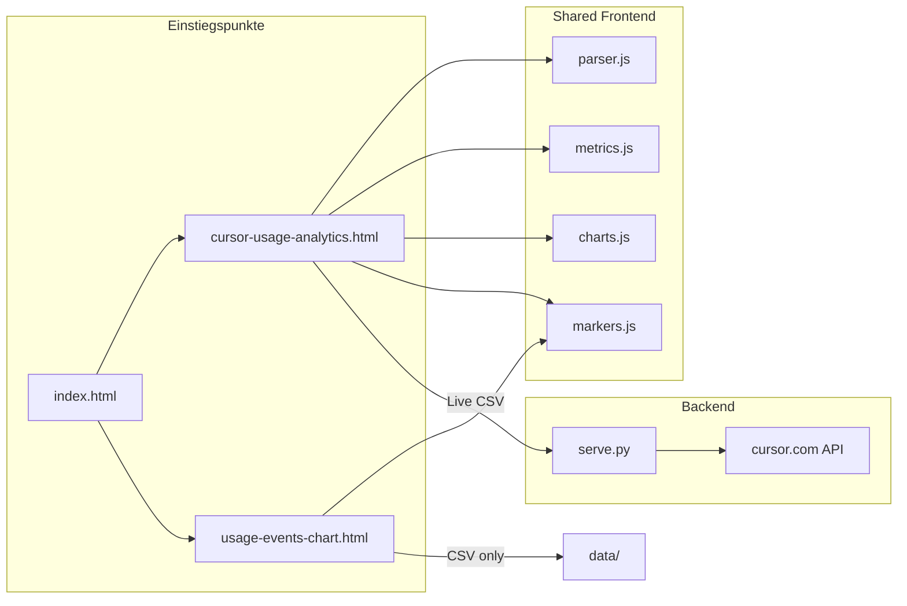

> Letzte Verifikation: 2026-06-21
> Geprüfte Dateien: 12
> Projektstand: uncommitted (Projekt-Marker Feature)
> Cursor Rule: `.cursor/rules/cursor-usage-dashboard.mdc`

# Cursor Usage Dashboard — Feature-Referenz

Master-Referenz für AI-Chats. Abdeckung: Hub, Analytics (Thin-Shell), Event-Chart (Fork), Shared-Module, Backend.

---

## 1. Quick-Lookup


| Aufgabe                                                       | Primäre Datei(en)                                                                              |
| ------------------------------------------------------------- | ---------------------------------------------------------------------------------------------- |
| CSV/API-Parsing, Event-Modell, Dedupe                         | `static/cursor-analytics/parser.js`                                                            |
| KPIs, Filter, Aggregationen, Granularität                     | `static/cursor-analytics/metrics.js`                                                           |
| Chart-Rendering, Legend-Persistenz, Zoom, Marker-Annotationen | `static/cursor-analytics/charts.js`                                                            |
| Projekt-Marker (CRUD, Statistik, Sync)                        | `static/cursor-analytics/markers.js`                                                           |
| Analytics-UI, Live-Fetch, Toolbar, Budget                     | `cursor-usage-analytics.html` (inline `<script>`)                                              |
| Event-Zoom-Charts (pro User, CSV-only)                        | `usage-events-chart.html` (inline `<script>`)                                                  |
| Live-API, Static-Serving, Event-Cache                         | `serve.py`                                                                                     |
| Multi-User-Konfiguration                                      | `parser.js` (`USERS`), `usage-events-chart.html` (`USERS`), `serve.py` (`USER_TOKENS`), `.env` |
| Navigation Hub                                                | `index.html`                                                                                   |
| Server-Start / Live-Setup                                     | `start.ps1`, `setup-live.ps1`                                                                  |


---

## 2. Architektur-Überblick

**Muster:** Hybrid aus parallelen Einstiegspunkten **ohne Runtime-Flag** (`isVariant` existiert nicht).




| Einstiegspunkt  | Muster               | Datenquellen                      | Shared-Module                  |
| --------------- | -------------------- | --------------------------------- | ------------------------------ |
| **Analytics**   | Thin-Shell           | CSV, Live (Proxy), Beides (Merge) | Ja — `window.CursorAnalytics`  |
| **Event-Chart** | Fork                 | Nur CSV                           | `markers.js` (+ inline Parser) |
| **Hub**         | Static HTML          | —                                 | Nein                           |
| **Backend**     | Python `http.server` | Proxy zu cursor.com               | —                              |


**Kein Build-Step:** Vanilla HTML/CSS/JS, Chart.js 4.4.7 + chartjs-plugin-zoom 2.2.0 + chartjs-plugin-annotation 3.1.0 + Hammer.js 2.0.8 (CDN, `defer`).

---

## 3. Dateistruktur & Ladereihenfolge

### Projektbaum (relevant)

```
serve.py                          # Static + API-Proxy
index.html                        # Hub
cursor-usage-analytics.html       # Analytics Thin-Shell
usage-events-chart.html           # Event-Chart Fork
static/cursor-analytics/
  parser.js                       # Event-Modell
  metrics.js                      # Aggregationen
  markers.js                      # Projekt-Marker
  charts.js                       # Chart.js-Rendering
data/                             # CSV-Exports + project-markers.json (gitignored)
.env                              # Session-Tokens (gitignored)
```

### Analytics — Script-Ladereihenfolge

1. **Head (defer):** Hammer.js → Chart.js → chartjs-plugin-zoom → chartjs-plugin-annotation
2. **DOMContentLoaded → `initWhenReady()`:** wartet auf `Chart` (Polling 50 ms)
3. `**ensureModules()`:** sequentiell `parser.js?v=15` → `metrics.js?v=15` → `markers.js?v=15` → `charts.js?v=15`
4. `**syncFromServer()`** (Marker) → `**initMarkerUi()**` → `**initToolbar()**` + `**loadDefaultCsvs()**`

Cache-Busting: Query `?v=15` auf Modul-URLs.

### Event-Chart — Script-Ladereihenfolge

1. **Head (defer):** Hammer.js → Chart.js → chartjs-plugin-zoom → chartjs-plugin-annotation → `markers.js`
2. **DOMContentLoaded → `initWhenReady()`:** wartet auf `Chart`, `Hammer`, `CursorAnalytics.markers`
3. `**syncFromServer()`** → `**initMarkerUi()**` → `**initToolbar()**` + `**loadDefaultCsvs()**`

### Backend — Routen


| Route                                   | Methode | Zweck                                                           |
| --------------------------------------- | ------- | --------------------------------------------------------------- |
| `/`                                     | GET     | Static → `index.html`                                           |
| `/health`                               | GET     | Token-Status, Port                                              |
| `/api/summary?user=`                    | GET     | Proxy → `cursor.com/api/usage-summary`                          |
| `/api/events?user=&startDate=&endDate=` | GET     | Proxy → Events (paginiert, gecacht)                             |
| `/api/events`                           | POST    | JSON-Body: `{ user, startDate?, endDate? }`                     |
| `/api/markers`                          | GET     | Projekt-Marker (`data/project-markers.json`), optional `?user=` |
| `/api/markers`                          | PUT     | Marker-Store speichern (JSON-Body `{ version, markers }`)       |
| `/*` (Datei existiert)                  | GET     | Static aus `PROJECT_DIR`                                        |


Event-Cache: In-Memory, TTL `CURSOR_EVENTS_CACHE_TTL` (Default 120 s), Key `user:startDate:endDate`.

---

## 4. Layout / Sections

### Hub (`index.html`)

- Ein `<main>` mit zwei Links: Event-Verlauf, Analytics
- Inline-CSS, keine JS-Abhängigkeiten

### Analytics (`cursor-usage-analytics.html`)


| Section             | ID / Selektor                                                      | Inhalt                                                                                                                                                   |
| ------------------- | ------------------------------------------------------------------ | -------------------------------------------------------------------------------------------------------------------------------------------------------- |
| Toolbar             | `#main-toolbar`                                                    | Datenquelle, User, CSV, Live, Export, Marker Export/Import                                                                                               |
| Projekt-Marker      | `#marker-card`, `#marker-table-body`                               | Intervall-Statistik mit Kosten                                                                                                                           |
| Projekt-Filter      | `#project-filter`                                                  | Filter für Einzelanfragen-Tabelle                                                                                                                        |
| Marker-Dialog       | `#marker-modal`, `#marker-form`                                    | CRUD (Von/Bis/Projekt/Aufgabe/Notiz)                                                                                                                     |
| Zeitraum / Anfragen | `#date-range-panel`                                                | Modus-Umschalter (`data-selection-mode`), Zeitraum-Presets (`#time-range-group`), Anfragen-Presets (`#count-range-group`, `data-count`), Custom datetime |
| Granularität        | `#granularity-select` (nur Zeitraum-Modus)                         | event / quarter / hour / day / week / month                                                                                                              |
| Drop-Zone           | `#drop-zone`                                                       | Drag-and-Drop CSV (wird nach Load versteckt)                                                                                                             |
| KPIs                | `#kpi-grid`                                                        | Dynamisch gerendert                                                                                                                                      |
| Übersicht-Chart     | `#overview-section`, `#chart-overview-daily`                       | Zeitraum: Buckets nach Granularität; Anfragen: Buckets pro Event (wie Granularität „Pro Anfrage“)                                                        |
| Detail-Charts       | `#chart-top-cost`, `#chart-top-tokens`, …                          | 8 Canvas-Elemente                                                                                                                                        |
| Tabellen            | `#daily-table-body`, `#expensive-table-body`, `#events-table-body` | Tages-, Teuerste-, Einzelanfragen (Spalte **Projekt**)                                                                                                   |
| Pagination          | `#events-pagination`                                               | 50 Events/Seite                                                                                                                                          |
| Budget              | `#budget-input`, `#budget-panel`                                   | Monatsbudget USD                                                                                                                                         |


### Event-Chart (`usage-events-chart.html`)


| Section        | ID                                          | Inhalt                                     |
| -------------- | ------------------------------------------- | ------------------------------------------ |
| Toolbar        | `#history-toolbar`                          | Zeitraum-Presets, Custom-Datum, CSV-Upload |
| Chart info     | `#chart-tokens-info`, `#chart-stats-info`   | Zoom/Pan pro Event, User info              |
| Chart slope    | `#chart-tokens-slope`, `#chart-stats-slope` | Zoom/Pan, Marker-Annotationen              |
| Projekt-Marker | `#marker-card`, `#marker-table-body`        | Intervall-Statistik (Tokens, kein Cost)    |
| Marker-Dialog  | `#marker-modal`                             | CRUD pro User-Chart                        |
| Tages-Tabelle  | `#usage-daily-table`, `#usage-daily-body`   | Tokens je Tag                              |


---

## 5. DOM-Hook-Register

### Analytics — Toolbar & State


| Hook                                              | Typ             | Verwendung                                                       |
| ------------------------------------------------- | --------------- | ---------------------------------------------------------------- |
| `[data-source="csv|live|merge"]`                  | Button          | `dataSource`-Variable                                            |
| `[data-user="all|info|slope"]`                    | Button          | `userFilter`                                                     |
| `[data-selection-mode="time|count"]`              | Button          | `selectionMode` — Zeitraum vs. letzte N Anfragen                 |
| `[data-hours="N"]`                                | Button          | Zeitraum-Preset (Stunden), nur im Modus `time`                   |
| `[data-all="true"]`                               | Button          | Modus „Alle Events“ (Zeitraum)                                   |
| `[data-count="N"]`                                | Button          | Letzte N Anfragen (10–1000), nur im Modus `count`                |
| `#count-from`, `#count-to`, `#count-custom-apply` | Number / Button | Bereich nach Rang (1 = neueste Anfrage), Modus `countRange`      |
| `[data-count-all="true"]`                         | Button          | Alle Anfragen (Count-Modus)                                      |
| `#granularity-select`                             | `<select>`      | Aggregation für Overview + Cumulative (nur `selectionMode=time`) |
| `[data-chart-key]`                                | Button          | Chart-Höhe 90 %, Zoom-Reset                                      |
| `#status-line`                                    | `<p>`           | Haupt-Status                                                     |
| `#load-hint`                                      | `<p>`           | Lade-Details                                                     |
| `#marker-add-overview` / `[data-marker-add]`      | Button          | Marker-Dialog (aktuelle Datum/Uhrzeit als Start)                 |
| `#marker-export-btn`, `#marker-import-input`      | Button / File   | Marker JSON Export/Import                                        |
| `#project-filter`                                 | `<select>`      | Events-Tabelle nach Projekt filtern                              |


### Analytics — Chart-Canvas-IDs

Mapping in `CHART_CANVAS_IDS` (inline JS):


| Key             | Canvas-ID              | charts.js-Key                                          |
| --------------- | ---------------------- | ------------------------------------------------------ |
| overview        | `chart-overview-daily` | `renderOverviewBuckets` / `renderOverviewTimeline`     |
| topCost         | `chart-top-cost`       | `topCost`                                              |
| topTokens       | `chart-top-tokens`     | `topTokens`                                            |
| tokenTypes      | `chart-token-types`    | `tokenTypes`                                           |
| modelFamily     | `chart-model-family`   | `modelFamily`                                          |
| byHour          | `chart-by-hour`        | `byHour`                                               |
| cumulative      | `chart-cumulative`     | `renderCumulativeBuckets` / `renderCumulativeTimeline` |
| inputOutput     | `chart-input-output`   | `inputOutput`                                          |
| cacheEfficiency | `chart-cache`          | `cacheEfficiency`                                      |
| byWeekday       | `chart-weekday`        | `byWeekday`                                            |


### Event-Chart — User-Konfiguration

`USERS` (inline, Zeile ~447):


| User  | defaultPaths                                                   | chartCanvasId        | statsId             |
| ----- | -------------------------------------------------------------- | -------------------- | ------------------- |
| info  | `./data/usage-events-2026.csv`, `./data/usage-events-2025.csv` | `chart-tokens-info`  | `chart-stats-info`  |
| slope | `./data/usage-events-slope.csv`                                | `chart-tokens-slope` | `chart-stats-slope` |


Event-Objekt (Fork): `{ user, date, dayKey, inputNoCache, cacheRead, outputTokens, totalTokens }` — **kein** `costCents`, **kein** `model`.

Analytics-Event (parser.js): `{ timestamp, dayKey, userLabel, model, kind, … costCents, source }`.

---

## 6. Abgrenzung zum Rest des Projekts


| Aspekt         | Analytics                                                                           | Event-Chart                                             |
| -------------- | ----------------------------------------------------------------------------------- | ------------------------------------------------------- |
| Parser         | `parser.js` (CSV + API)                                                             | Inline `parseUsageEvents`                               |
| Kosten         | Ja (`costCents`, Budget)                                                            | Nein                                                    |
| Live-API       | Ja (via `serve.py`)                                                                 | Nein                                                    |
| Charts         | 10+ Chart-Typen, Granularität; Anfragen-Modus: Timeline-Zoom für Overview/Kumuliert | 2 Line-Charts, pro Event                                |
| User-Filter    | Gesamt / info / slope                                                               | Immer beide Charts parallel                             |
| Zeitraum-Input | `datetime-local`                                                                    | `date` (nur Datum)                                      |
| Dedupe         | `parser.mergeEvents` / `eventDedupeKey`                                             | Eigene `eventDedupeKey` (andere Felder)                 |
| Export         | JSON (+ Marker im Payload)                                                          | Marker JSON Export/Import                               |
| localStorage   | Budget, Granularität, Selection-Mode, Count, Chart-Sichtbarkeit, Marker             | Marker auch serverseitig in `data/project-markers.json` |


**Drift-Risiko:** CSV-Pfade und User-Labels an drei Stellen (`parser.js`, `usage-events-chart.html`, `serve.py` + `.env`). Spalten-Erwartungen im Event-Chart sind Teilmenge von Analytics (kein Cost/Model/Kind).

---

## 7. Override-/Patch-Verhalten

Keine Monkey-Patches. Event-Chart ist ein **Fork** — Änderungen an `parser.js` wirken **nicht** automatisch auf `usage-events-chart.html`.

Bei CSV-Format-Änderungen: beide Parser prüfen (`parseUsageEventsCsv` vs. inline `parseUsageEvents`).

---

## 8. CSS-Architektur

- **Kein gemeinsames Stylesheet** — Design-Tokens in `:root` sind in beiden HTML-Dateien **dupliziert**
- Gemeinsame Tokens: `--bg`, `--surface`, `--surface-2`, `--text`, `--muted`, `--accent`, `--warn`, `--danger`, `--border`, `--radius`
- Analytics hat zusätzliche Klassen: `.dashboard-grid`, `.kpi-grid`, `.drop-zone`, `.live-loading`, `.events-pagination`
- Event-Chart: `.history-toolbar`, `.history-btn`, `.chart-stats`, `.card--history`
- Dynamischer Zustand: `.btn--active`, `.btn--loading`, `.drop-zone--hidden`, `.status-error`, `[aria-pressed="true"]` auf Chart-Höhe-Buttons

---

## 9. Initialisierungsfluss

### Analytics

```
DOMContentLoaded
  → initWhenReady (poll Chart.js)
    → ensureModules (parser → metrics → markers → charts)
      → syncFromServer (Marker)
      → initMarkerUi + initToolbar
        → loadDefaultCsvs (fetch ./data/*.csv)
          → renderAll
            → filteredEvents → KPIs, Tabellen, charts.renderAll
```

Live-Pfad bei `dataSource === 'live'|'merge'`:

```
applyRangeAndRender / live-refresh
  → fetchLiveEvents
    → GET /api/events?user=…&startDate=&endDate=
    → normalizeApiEvent (parser.js)
    → mergeEvents (bei incremental/beides)
    → renderAll
```

Client-Cache: `liveFetchState` (5 Min TTL), incremental overlap 5 Min.

### Event-Chart

```
DOMContentLoaded
  → initWhenReady (poll Chart + Hammer + markers)
    → syncFromServer → initMarkerUi → initToolbar
      → loadDefaultCsvs
        → fetchCsvText → parseUsageEvents → mergeEvents
          → applyLoadedEvents → renderCharts + renderDailyTable
```

### Backend

```
python serve.py
  → load_dotenv(.env)
  → ThreadingHTTPServer(CURSOR_WEB_HOST:CURSOR_WEB_PORT)
  → CursorUsageHandler (GET/POST/PUT/OPTIONS)
```

Marker-Sync: `GET/PUT /api/markers` → `data/project-markers.json` (atomisches Schreiben). Client: `localStorage` + Server-Merge bei Start; Server gewinnt bei gleicher `id` und neuerem `updatedAt`.

---

## 10. Datenmodell & APIs

### Projekt-Marker (`markers.js`)

Marker sind **keine CSV-Daten** — manuell gesetzte Metadaten zu Zeitintervallen.

```json
{
  "version": 1,
  "markers": [
    {
      "id": "m-uuid",
      "user": "info",
      "start": "2026-06-20T14:30:00.000Z",
      "end": null,
      "project": "Cursor-Usage-Dashboard",
      "task": "REFERENCE.md",
      "note": "",
      "createdAt": "...",
      "updatedAt": "..."
    }
  ]
}
```

- `**end: null`:** Intervall `[start, nächster Marker)` oder bis Filter-Ende (in UI mit `*` gekennzeichnet).
- `**user`:** `info` | `slope` | `all`
- Statistik (`computeStats`): Events im Intervall — nicht persistiert.

**Chart-Annotationen:** Overview + Cumulative nutzen Kategorie-Achse → Bucket-Index-Mapping via `sortKey`. Event-Chart nutzt Zeitachse (`mode: 'time'`).

**Gotcha Granularität:** Bei Wechsel der Granularität verschieben sich Bucket-Grenzen — Marker-Positionen in Overview/Cumulative (Zeitraum-Modus mit grober Granularität) sind Näherungen. Marker-Boxen nutzen `bucketIndexRangeForInterval` (Überlappung von Intervall und sichtbaren Buckets; bei Pro-Anfrage-Buckets optional User-Filter).

**Anfragen-Modus:** `filterEventsByCount` liefert die neuesten N Events oder einen Von–Bis-Bereich (`countRange`, 1 = neueste). Live-Fetch nutzt heuristische Zeitfenster nach Anzahl (nicht mehr pauschal „gesamter Verlauf“), nur User mit Token (`/health`). Beim Wechsel zurück zu Zeitraum wird der Vollcache invalidiert.

### Normalisiertes Event (Analytics)

Siehe `parser.js` → `normalizeEvent()`. Wichtige Felder: `timestamp`, `userLabel`, `model`, `totalTokens`, `costCents`, `isIncluded`, `source` (`csv`|`api`).

### Kostenberechnung (Analytics)

**Grundprinzip:** Das Dashboard **berechnet keine Kosten aus Token-Mengen und Modell-Preisen**. Jede Anfrage erhält ein `costCents`-Feld aus der **Cursor-Quelle** (CSV-Spalte `Cost` oder Live-API). KPIs, Charts, Budget und Marker-Statistik **summieren** diese Werte — sie leiten sie nicht neu ab.

**Ohne Gewähr:** Alle angezeigten Kosten, Summen, Budget-Vergleiche und Prognosen sind **rein informativ** und **ohne Gewähr**. Sie sind **keine offizielle Abrechnung** von Cursor, können von der tatsächlichen Rechnung abweichen und dienen nicht steuerlichen oder vertraglichen Zwecken. Abweichungen sind u. a. möglich durch: veraltete oder unvollständige CSV-Exports, Parse-Fehler, API-Änderungen, Merge/Dedupe, Included-/Chargeable-Logik, Rundung, unvollständige Live-Daten oder die Monats-Prognose-Heuristik (Ø/Tag × 30). Maßgeblich ist ausschließlich die Abrechnung im Cursor-Dashboard bzw. bei Cursor.

**Event-Chart:** Keine Kosten (`usage-events-chart.html` parst keine `Cost`-Spalte).

#### Pro Event: `costCents` (`parser.js`)

Implementierung: `parseCostCents()` (CSV + API-Fallback) und `normalizeApiEvent()`.


| Quelle       | Eingabe                                                                                | Regel                                                              |
| ------------ | -------------------------------------------------------------------------------------- | ------------------------------------------------------------------ |
| **CSV**      | Spalte `Cost` (optional), `Kind`                                                       | Siehe Tabelle unten                                                |
| **Live-API** | 1. `chargedCents` → 2. `tokenUsage.totalCents` → 3. `usageBasedCosts` (String wie CSV) | Gerundet auf ganze Cent; `costDisplay` aus API-String oder `$X.XX` |


`**parseCostCents(costRaw, kindRaw)` — Text → Cent:**


| `Cost` / `Kind`                       | `costCents`             | `isIncluded` | Anzeige                  |
| ------------------------------------- | ----------------------- | ------------ | ------------------------ |
| leer, `Included`, Kind `included`     | 0                       | ja           | Original oder „Included“ |
| `No charge`, `Errored`                | 0                       | nein         | Originaltext             |
| Dollar-String (z. B. `$0.04`, `0,04`) | `Math.round(USD × 100)` | nein         | Originaltext             |
| nicht parsebar                        | 0                       | nein         | Originaltext             |


**API-Zusatz:** `isIncluded` auch wenn `costCents === 0` und Kind `INCLUDED` enthält oder `!isChargeable`. `isChargeable` = API-Flag oder `costCents > 0`.

**Anzeige in „Einzelne Anfragen“:** Bei Included → `costDisplay` (nicht `$0.00`); sonst USD-Format aus `costCents / 100` (`formatEventCost` in Analytics-HTML).

#### Aggregation (Summen)

Alle folgenden Werte nutzen **dieselbe Event-Liste** nach Toolbar-Filter (Datenquelle, User, Zeitraum/Anfragen-Modus), sofern nicht anders vermerkt:


| UI / Metrik                                 | Berechnung                                        | Besonderheit                                                              |
| ------------------------------------------- | ------------------------------------------------- | ------------------------------------------------------------------------- |
| KPI **Gesamtkosten**                        | `sum(costCents)`                                  | Included = 0 $                                                            |
| KPI **Ø/Tag**, **Prognose/Monat**           | Kosten ÷ Tage im Filter × 30                      | Heuristik, kein Abrechnungswert von Cursor                                |
| Charts (Overview, Top-Kosten, kumuliert, …) | Bucket-/Modell-Summen aus `costCents`             | in `metrics.js` / `charts.js`                                             |
| **Budget (aktueller Monat)**                | `sum(costCents)` aller Events **ab Monatsanfang** | Ignoriert Zeitraum-Toolbar; nutzt geladene Events (CSV + ggf. Live/Merge) |
| **Projekt-Marker**                          | `sum(costCents)` im Intervall `[start, end)`      | in `markers.js` → `computeStats`                                          |
| Filter **Min. Kosten ($)**                  | Events mit `costCents ≥ eingegebener USD × 100`   | Nur Tabellenfilter, ändert keine Berechnung                               |


#### Konfigurierbare Werte (keine Preisliste)


| Einstellung          | Speicher                                                          | Wirkung                                                                           |
| -------------------- | ----------------------------------------------------------------- | --------------------------------------------------------------------------------- |
| **Monatsbudget ($)** | `localStorage` `cursor-analytics-monthly-budget-usd` (Default 70) | Vergleich „Ausgaben Monat vs. Budget“ — **kein** Faktor für `costCents` pro Event |
| **Min. Kosten ($)**  | Session (Input `#events-min-cost`)                                | Filter in Einzelanfragen-Tabelle                                                  |


**Nicht unterstützt (Stand v0.1):** Eigene $/Token-Raten, manuelle Kosten pro Modell, Schätzung fehlender CSV-`Cost`-Spalten aus Token-Zahlen, Umrechnung Währung. Fehlt `Cost` in CSV → `costCents = 0` (Tokens werden trotzdem gezählt).

#### Datenquelle CSV vs. Live vs. Beides

- **CSV:** Kosten wie im Export von Cursor.
- **Live:** Kosten wie von der inoffiziellen API geliefert (`chargedCents` / `usageBasedCosts`).
- **Beides (Merge):** `parser.mergeEvents` dedupliziert per `eventDedupeKey`; bei gleichem Key gewinnt der **spätere** Eintrag in der Liste — im Modus **Beides** typischerweise **Live vor CSV** (`mergeEvents([allCsvEvents(), allLiveEvents()])`). Keine Mittelung oder Neuberechnung.

### CSV-Spalten (Analytics)

Pflicht: `Date`, `Input (w/o Cache Write)`, `Cache Read`, `Output Tokens`, `Total Tokens`. Optional: `Kind`, `Model`, `Max Mode`, `Input (w/ Cache Write)`, `Cost`.

### Live-API (inoffiziell)

Upstream: `https://cursor.com/api/usage-summary`, `https://cursor.com/api/dashboard/get-filtered-usage-events`. Auth: Cookie `WorkosCursorSessionToken`.

### localStorage-Keys


| Key                                   | Default                       | Zweck                                                                       |
| ------------------------------------- | ----------------------------- | --------------------------------------------------------------------------- |
| `cursor-analytics-monthly-budget-usd` | 70                            | Monatsbudget (Analytics)                                                    |
| `cursor-analytics-granularity`        | `hour`                        | Overview-Aggregation (Zeitraum-Modus)                                       |
| `cursor-analytics-selection-mode`     | `time`                        | `time` = Zeitraum-Filter, `count` = letzte N Anfragen                       |
| `cursor-analytics-count`              | `50`                          | Default-Anzahl im Anfragen-Modus                                            |
| `cursor-analytics-time-range`         | `hours` / 24 h                | Aktiver Zeitraum-Filter (`mode`, `hours`, optional `customFrom`/`customTo`) |
| `cursor-analytics-custom-range`       | heute−2d / heute              | Von/Bis-Zeitraum (Analytics, JSON `{ customFrom, customTo }`)               |
| `cursor-analytics-chart-visibility`   | `{}`                          | Legend-Sichtbarkeit pro Chart-Key                                           |
| `cursor-usage-markers-v1`             | `{ version: 1, markers: [] }` | Projekt-Marker (Primary Client-Cache)                                       |
| `cursor-event-chart-markers-v1`       | —                             | Legacy-Key (Migration → `cursor-usage-markers-v1`)                          |
| `cursor-event-chart-custom-range`     | heute−2d / heute              | Von/Bis-Zeitraum (Event-Chart, JSON `{ customFrom, customTo }`)             |


Server-Datei: `data/project-markers.json` (liegt unter gitignored `data/`).

---

## 11. Impact-Checkliste bei Shared-Änderungen


| Änderung an …              | Prüfen auch …                                                                |
| -------------------------- | ---------------------------------------------------------------------------- |
| CSV-Spalten / Parser-Logik | `parser.js` **und** `usage-events-chart.html` (Fork)                         |
| User `info`/`slope` Pfade  | `parser.js` `USERS`, Event-Chart `USERS`, `serve.py` `USER_TOKENS`, `.env`   |
| Design-Tokens / Theme      | Beide HTML-Dateien (`:root`)                                                 |
| Chart.js-Version (CDN)     | Beide HTML-Heads                                                             |
| API-Response-Format        | `parser.js` `normalizeApiEvent`, `serve.py` Proxy                            |
| Neue Analytics-Features    | Event-Chart bewusst out of scope — nur dokumentieren wenn Parität gewünscht  |
| `serve.py`-Routen          | Analytics/Event-Chart `fetch()` (`PROXY_BASE` = `''`), Marker `/api/markers` |
| Marker-Schema / Sync       | `markers.js`, `serve.py`, beide HTML-Einstiegspunkte                         |


---

## 12. Bekannte Einschränkungen

- Kosten in Analytics: übernommen/summiert aus CSV/API — **ohne Gewähr**, keine offizielle Abrechnung (siehe §10 Kostenberechnung)
- Enterprise Admin API nicht implementiert
- Event-Chart: keine Kosten; Analytics Anfragen-Modus: gleiche Pro-Anfrage-Bucket-Charts wie Zeitraum + Granularität `event`
- Sehr große Event-Mengen → Browser-Performance
- Session-Tokens laufen ab (401 → Hinweis in `serve.py`)
- `file://`-Öffnung: Modul-Laden und CSV-Fetch schlagen fehl → `python serve.py` nötig

---

## Verwandte Dokumentation

- Setup: `[README.md](../README.md)`
- Entwickler-Referenz: `[docs/REFERENCE.md](REFERENCE.md)`
- Cursor Rule (Scope): `[.cursor/rules/cursor-usage-dashboard.mdc](../.cursor/rules/cursor-usage-dashboard.mdc)`

